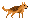
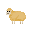

# AIgricultor

---

Tom ZINCK, Killian VIGUIER, Andrew MANSOUR, Theo REYNIER

---

A four person academic project.
This is a self playing game, where a dog needs to do his best to keep as many sheep as possible in their enclosure.

---

## States

### Dog

The dog has two main states:
* Idle: In this state, the dog patrols around the enclosure.
* Bark: Here, the dog will bark at any escaped sheep.

### Sheep

Sheep have three main states:
* Idle: Walking around aimlessly in their enclosure.
* Escape: Once close to the border of the fence, and the dog is not nearby, the sheep will leap over the fence and try to escape.
* BackToPlace: After being barked at, the sheep will walk back to the enclosure.
